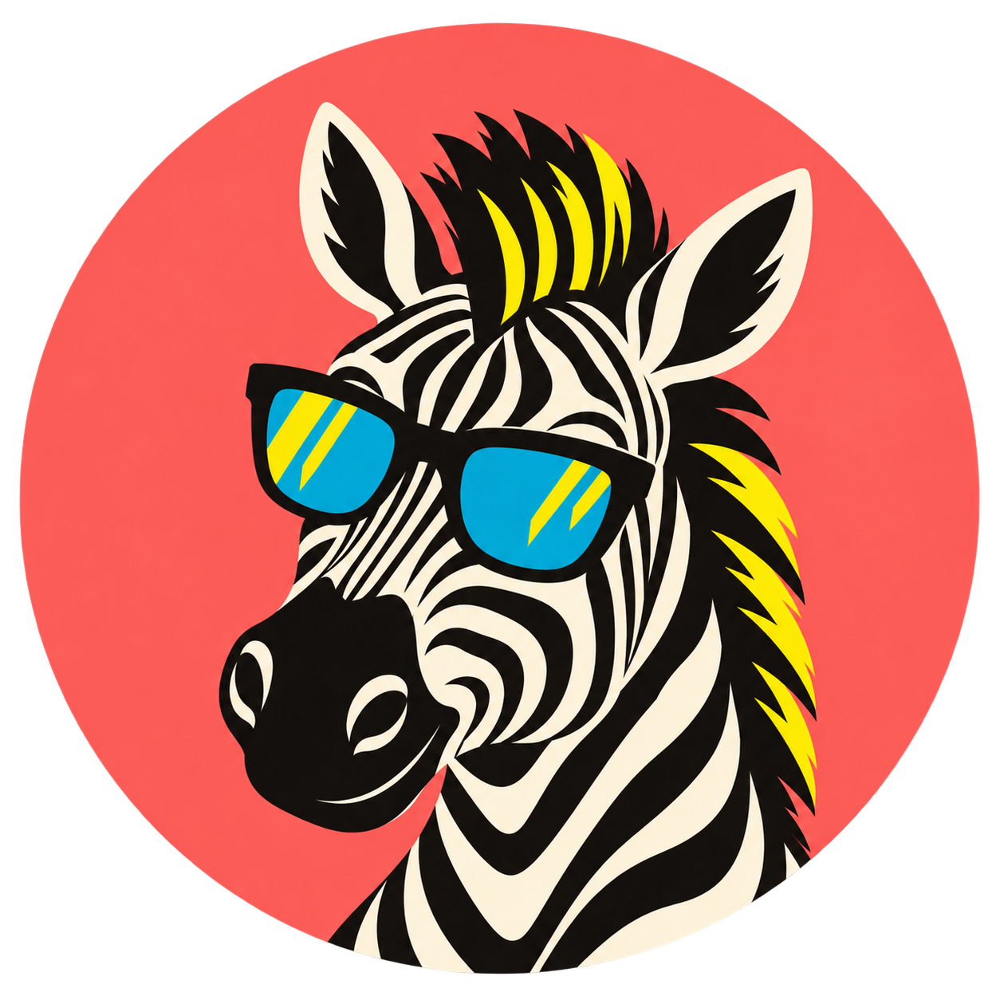
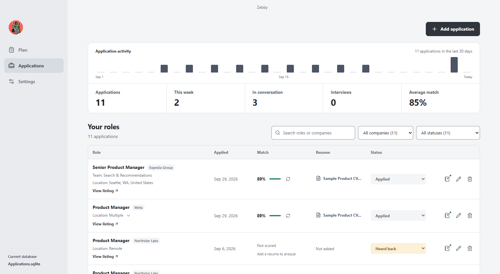
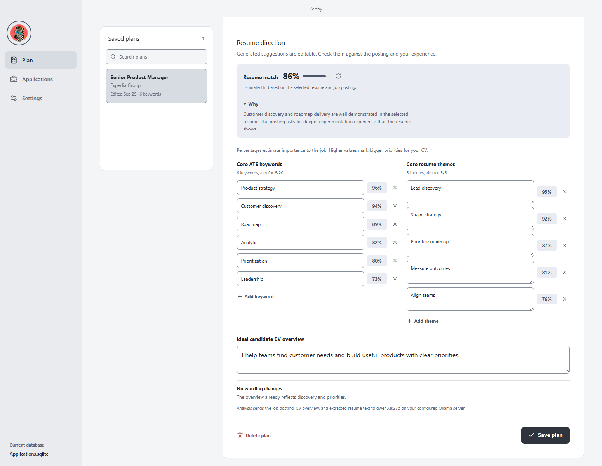

# Zebby

**Your job search sidekick. Excellent stripes. Questionable sunglasses.**

I wanted to build something useful for my fellow peers: a simple place to prepare for roles, keep track of applications, and stop wondering which resume went where. Meet Zebby. Zebby's cool, and Zebby doesn't require you to sign in.

## Get Zebby

[Download for Windows or Apple Silicon Mac](https://github.com/desigrit/zebby-the-scout/releases/latest). Choose the Windows x64 or ARM64 `.exe`, or the Apple Silicon `.dmg`. No ZIP to unpack, no account to create.

These builds are unsigned. See the [installation notes](docs/guide.md#install) if your computer asks you to approve the app.

## A little scout for the whole search

- **Plan a role.** Paste a listing, attach a resume, and get ATS keywords, resume themes, a match score with an explanation, and a CV overview that keeps your writing style. Keyword and theme percentages estimate importance to the job.
- **Track the application.** Save the company, role, locations, status, resume, and notes. Details are optional. A 30-day chart shows how your search is moving.
- **Keep the receipts.** Zebby saves a readable listing copy when the site allows it, so a closed posting does not have to disappear. You can paste it yourself, too.
- **Pick your AI.** Use OpenAI, your own Ollama model, or download a built-in CPU model from Settings. The smallest options need no GPU. Review suggestions before using them, especially with smaller models.
- **Take your data with you.** Applications, plans, and resumes live in a SQLite file you choose. Put it in a cloud synced folder to share it between your PCs. Quit Zebby and let syncing finish before switching computers.

### Applications, without the spreadsheet shuffle

### A plan for the next role

Built-in analysis stays on your computer. OpenAI and configured Ollama servers receive the job and resume text needed for analysis. API keys and downloaded models stay on each computer, outside the shared database. Zebby detects changes to the shared file and keeps an original copy before upgrading its database format. A cloud drive cannot merge simultaneous SQLite edits.

## Peek under the stripes

Built with Electron, React, TypeScript, SQLite, and a small native inference engine. For setup, model terms, and build instructions, see the [full guide](docs/guide.md). Ideas and bug reports are welcome in [Issues](https://github.com/desigrit/zebby-the-scout/issues).
